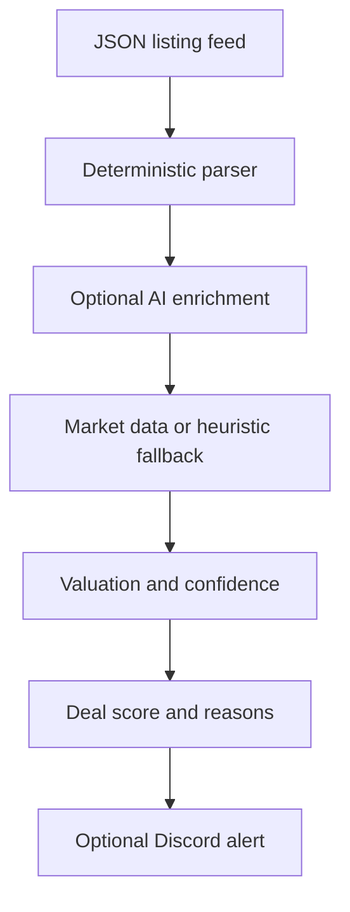

<p align="center">
  
</p>

<p align="center">
  <a href="https://github.com/quangshuynh/flipper/actions/workflows/ci.yml"></a>
  <a href="https://www.python.org/"></a>
  <a href="LICENSE"></a>
</p>

<p align="center">
  Flipper analyzes secondhand computer listings, extracts hardware specifications, estimates resale value, and ranks potential deals using expected resale economics and evidence quality. It currently reads a local or exported JSON feed; it does not crawl marketplaces by itself.
</p>

## Pipeline



The deterministic parser runs first. AI enrichment is optional and only fills missing values. If AI, market data, or Discord is unavailable, the local analysis path can continue.

## Pricing

The estimator combines component heuristics with locally stored market prices when a matching database row exists. Market data is preferred; static component values are a fallback. eBay Browse results are active listing prices, not completed-sale prices, so estimates should be treated as directional.

For each listing, Flipper distinguishes:

- asking price
- estimated market value
- expected resale value, using a conservative 95% adjustment
- ideal buy price, using a 68% threshold
- estimated gross profit: `expected resale value - asking price`
- ROI: gross profit divided by asking price, when asking price is positive

Gross profit does not include fees, repairs, taxes, shipping, or labor because those costs are not modeled.

## Scoring

The deterministic score considers price versus value, expected gross profit, identified core hardware, extras, negotiability, and distance. Seller uncertainty is retained as listing metadata but never increases the score. A score is capped at 100 and should be read alongside the extracted fields and pricing evidence.

## Data and integrations

- `data/listings.json` is the sample local feed.
- `collectors/json_feed_collector.py` accepts a top-level list or `{ "listings": [...] }`.
- `pricing/market_updater.py` can refresh component prices through the eBay Browse API and stores them in `data/part_prices.db`.
- `utils/dedupe.py` stores processed listing IDs in `data/flipper_seen.db`.
- Discord alerts use `DISCORD_WEBHOOK_URL` and are optional.
- Groq-compatible AI enrichment uses `GROQ_API_KEY` and is optional.

## Setup

Use Python 3.13 or newer.

```bash
python -m venv .venv
.venv\\Scripts\\activate
pip install -r requirements-dev.txt
copy .env.example .env
```

Set only the environment variables needed for the integrations you use. `.env` is ignored by Git. The sample feed can be analyzed with:

```bash
python main.py
```

Discord is disabled when `DISCORD_WEBHOOK_URL` is empty. eBay price refresh is a separate operation and requires `EBAY_OAUTH_TOKEN`:

```bash
python -m pricing.market_updater
```

## eBay seller orders

Seller OAuth is separate from the application token used by the Browse price updater and the
application token used to verify deletion notifications. It authorizes Flipper to read orders
belonging to one consenting seller. Flipper requests only
`https://api.ebay.com/oauth/api_scope/sell.fulfillment.readonly`; it does not implement any eBay
write operation.

Configure these values in your uncommitted `.env` using credentials from one environment only:

```dotenv
EBAY_SELLER_ENV=production
EBAY_SELLER_CLIENT_ID=
EBAY_SELLER_CLIENT_SECRET=
EBAY_SELLER_RUNAME=
```

In the eBay Developer Portal, open the matching Production keyset under **Application Keys**, then
**User Tokens**. Under **Your eBay Sign-in Settings**, add eBay Redirect URL, configure its real Auth Accepted and Auth Declined
URLs (and the requested policy/contact fields), enable OAuthand copy the eBay-generated RuName into
`EBAY_SELLER_RUNAME`. A RuName is not an arbitrary callback URL and Production and Sandbox RuNames
are different.

Start the one-time consent flow with:

```bash
python main.py ebay connect
```

Flipper opens and prints eBay's consent URL. After consent, copy the full redirected URL from the
browser and paste it into the waiting CLI. The CLI verifies OAuth state and immediately exchanges
the short-lived code (the pasted URL is hidden at the prompt). It stores the long-lived refresh
token in the operating system credential store through `keyring`; the authorization code is not
stored, and User access tokens remain only in process memory and refresh automatically. Do not
place any token in `.env`.

Retrieve the most recent 30 days of orders, or specify an inclusive eBay-supported creation range:

```bash
python main.py ebay orders
python main.py ebay orders --from 2026-09-01 --to 2026-09-16
```

The client follows every Fulfillment API page. eBay currently limits searchable order history to
two years. Output excludes buyer names, addresses, email addresses, phone numbers, and raw API
responses. Remove the locally stored refresh token with `python main.py ebay disconnect`. This does
not revoke consent at eBay; use your eBay account's third-party authorization settings when remote
revocation is also desired.

Order totals are buyer-facing order amounts, not net seller proceeds. Flipper does not yet retrieve
fees, payouts, shipping-label costs, refunds/credits comprehensively, or calculate actual profit.

## Local inventory

Inventory is persisted independently of eBay in the ignored local SQLite database
`data/flipper_inventory.db`. Each acquisition receives a durable human-facing ID (`Q0001`, `Q0002`,
and so on) distinct from its internal database key. IDs are transactionally allocated and are not
reused after deletion. Acquisition cost is required in USD and stored exactly as integer cents;
quantity must be positive.

```bash
python main.py inventory add --title "Example item" --source "estate sale" --acquired-at 2026-09-01 --cost 25.00
python main.py inventory list
python main.py inventory show Q0001
```

Existing records can be corrected or enriched with partial updates. Unspecified fields remain
unchanged; pass an empty string to clear an optional marketplace field or notes.

```bash
python main.py inventory update Q0001 --notes "Tested and ready to list"
python main.py inventory update Q0001 --marketplace eBay --marketplace-item-id 123456789012 --marketplace-sku Q0001
python main.py inventory update Q0001 --marketplace-item-id ""
```

Status changes use a dedicated lifecycle operation and record UTC event timestamps automatically:

```bash
python main.py inventory status Q0001 listed
python main.py inventory status Q0001 sold
```

New items begin as `acquired`. The normal forward transitions are `acquired → listed → sold`;
`acquired` or `listed` items may instead be archived. Archival preserves any lifecycle timestamps.
For practical corrections, `sold → listed` clears `sold_at` but retains `listed_at`,
`listed → acquired` clears both lifecycle timestamps, and `archived → acquired` restores the item
while clearing both timestamps. A restored item can then be listed again. Generic
`inventory update` cannot change status.

Lifecycle timestamps use ISO 8601 UTC values ending in `Z`. Databases created with schema v1 are
migrated automatically; existing records receive null lifecycle timestamps because Flipper does
not infer historical events.

An item can optionally retain marketplace linkage by using `inventory update` after creation.

Marketplace item IDs and SKUs can be compared with read-only eBay order lines:

```bash
python main.py ebay reconcile
python main.py ebay reconcile --from 2026-09-01 --to 2026-09-30
```

Reconciliation uses an exact SKU/custom-label match scoped to the eBay marketplace. Marketplace +
SKU pairs are unique in inventory; marketplace names are compared case-insensitively, while SKU
values remain case-sensitive. Missing, unmatched, and ambiguous lines are reported without guessing
from titles, prices, or buyer data. The command does not persist orders, change inventory status,
set lifecycle timestamps, or mark anything sold. Flipper keeps local inventory authoritative and
does not store buyer names, contact details, or addresses.

After reviewing reconciliation, explicitly import eligible order lines as durable local sales:

```bash
python main.py ebay import-sales
python main.py ebay import-sales --from 2026-09-01 --to 2026-09-30
python main.py sales list
python main.py sales show S000001
```

Import is manual and never runs during `ebay reconcile` or in the background. Only a line with an
exactly one-record reconciliation, a gross line-item amount, order-line quantity 1, and matched local
inventory quantity 1 in `listed` status can be imported. Flipper does not infer partial-inventory
semantics. The sale insert and `listed → sold` lifecycle transition are one SQLite transaction, and
the eBay order creation time becomes `sold_at`.

The durable external identity is eBay marketplace + order ID + line-item ID. A database uniqueness
constraint prevents duplicate imports. Repeating identical data is a no-op reported as already
imported; changed immutable economics for that identity are reported as a conflict and never
overwrite history. Gross line-item money is stored exactly as a scaled integer with its scale and
three-letter currency; no binary floating point, USD assumption, or exchange-rate conversion is
used.

Persisted sales contain only the linked local inventory key/Q-number, marketplace, eBay order and
line identifiers, SKU, quantity, gross amount and currency, sale time, and import time. Buyer names,
usernames, email, phone, recipient, and address data are not retained. Gross sale value is not
profit. Acquisition cost is included in the local recorded-profit calculation, while marketplace
fees, seller-paid shipping, refunds, and other reducing adjustments are stored as separate explicit
components:

```bash
python main.py sales add-cost S000001 --type marketplace_fee --amount 10.44
python main.py sales add-cost S000001 --type shipping_cost --amount 7.25
python main.py sales add-cost S000001 --type refund --amount 5.00 --note "partial refund"
python main.py sales show S000001
python main.py sales remove-cost C000001
```

Component amounts are always nonnegative; every currently supported type reduces proceeds. This
avoids double-negative entries. Each component has a stable local C-number, sale link, exact scaled
integer amount, currency, source, optional note, and creation time. CLI entries are marked
`source=manual`; they are not verified against eBay. Removing a mistaken component does not reuse
its C-number.

The displayed recorded realized profit is gross sale amount minus acquisition cost and all recorded
components. No stored profit total is cached or mutated. A missing fee, shipping, or refund entry
means only that no such cost has been recorded—not that the true cost was zero—so the display marks
the result as incompletely reconciled. Acquisition cost is currently USD; Flipper will not calculate
profit for a sale in another currency and never performs currency conversion. eBay Finances,
automatic fee/refund import, payouts, and full reconciliation remain deferred.

## eBay account deletion notifications

The isolated FastAPI service in `ebay/compliance.py` supports eBay Marketplace Account
Deletion/Closure endpoint verification and notification acknowledgement. It does not change or
depend on the CLI analysis pipeline.

Set these values in an uncommitted `.env` or, in production, in your hosting provider's secret
configuration:

```dotenv
EBAY_ACCOUNT_DELETION_TOKEN=
EBAY_ACCOUNT_DELETION_ENDPOINT=https://your-domain.example/api/ebay/account-deletion
EBAY_NOTIFICATION_ENV=production
EBAY_CLIENT_ID=
EBAY_CLIENT_SECRET=
```

The token must contain 32-80 letters, numbers, underscores, or hyphens. Generate one without
printing or committing it, for example by writing a Python-generated token directly into your
local `.env` (run this once):

```bash
python -c "import secrets; open('.env', 'a', encoding='utf-8').write('EBAY_ACCOUNT_DELETION_TOKEN=' + secrets.token_urlsafe(48) + '\n')"
```

Ensure `.env` contains only one value for that variable. The endpoint value must exactly match
the URL entered in eBay, including capitalization and any trailing slash; the configured route
above has no trailing slash.

For local development, load `.env` into the process environment and run:

```bash
uvicorn ebay.compliance:app --env-file .env --reload --host 127.0.0.1 --port 8000
```

The production start command is:

```bash
uvicorn ebay.compliance:app --host 0.0.0.0 --port 8000
```

Use the port mechanism required by your hosting provider when it supplies one. The production
callback must be deployed at a stable, publicly reachable HTTPS URL. eBay does not accept
`localhost` or an internal IP address, so the local server is only for development.

In the eBay Developer Portal, open the Production keyset's **Alerts & Notifications** page,
select **Marketplace Account Deletion**, save an alert email, and enter the exact deployed URL
and the same verification token. Saving triggers a GET challenge. After verification succeeds,
use **Send Test Notification** and confirm the deployed service returns a success response.

For each POST, the service Base64-decodes eBay's `X-EBAY-SIGNATURE` envelope, retrieves the
identified ECC public key through eBay's Notification API using an application OAuth token, and
verifies the ECDSA/SHA-1 signature before processing or acknowledging the notification. Public
keys are held in a process-local LRU cache for one hour (up to 100 keys), and application OAuth
tokens are reused until shortly before expiry. Missing, malformed, or invalid signatures receive
`412 Precondition Failed`; temporary OAuth or public-key retrieval failures receive a server
error so eBay can retry. Set `EBAY_CLIENT_ID` and `EBAY_CLIENT_SECRET` to the Production App ID
and Cert ID through secret configuration only; never commit or print either value. Keep
`EBAY_NOTIFICATION_ENV=production` for the Production callback. This setting is intentionally
separate from `EBAY_ENV`, which continues to select the Browse price updater's environment.

The current verified POST processing performs no data deletion because Flipper does not persist
eBay seller, buyer, or order data. Before adding seller/order persistence, implement irreversible
deletion of all applicable user data at the explicit processing boundary in
`ebay/compliance.py`.

## Tests and CI

Run the deterministic offline suite with:

```bash
pytest
ruff check .
ruff format --check .
```

GitHub Actions runs the same lint, formatting, and test commands on pushes and pull requests targeting `main`. Tests mock external behavior and do not send Discord messages or call eBay/Groq.

## Limitations

- The default collector consumes local/exported JSON rather than live marketplace pages.
- Valuation is heuristic and depends on accurate extracted hardware.
- eBay Browse data reflects asking prices and may include condition, shipping, and listing-quality differences.
- No repair, transaction fee, tax, shipping, labor, warranty, or inventory cost model is included.
- Missing or ambiguous specifications reduce confidence; they are not inferred as certainty.
- The optional AI integration is not required for core parsing and can fail independently.
- Local SQLite files are runtime state and should not be committed.

## Configuration

See `.env.example` for all supported variables, including location and deal thresholds. Do not put credentials, webhook URLs, or access tokens in source files.

## License

MIT. See [LICENSE](LICENSE).
