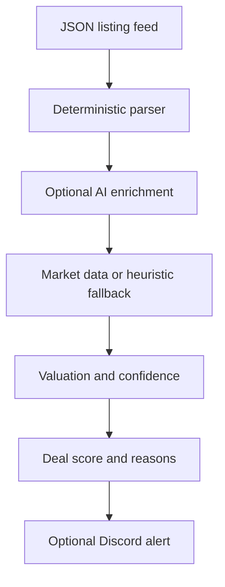

<p align="center">
  
</p>

<p align="center">
  <a href="https://github.com/quangshuynh/flipper/actions/workflows/ci.yml"></a>
  <a href="https://www.python.org/"></a>
  <a href="LICENSE"></a>
</p>

<p align="center">
  Flipper analyzes secondhand computer listings, extracts hardware specifications, estimates resale value, and ranks potential deals using expected resale economics and evidence quality. It currently reads a local or exported JSON feed; it does not crawl marketplaces by itself.
</p>

## Pipeline



The deterministic parser runs first. AI enrichment is optional and only fills missing values. If AI, market data, or Discord is unavailable, the local analysis path can continue.

## Web dashboard

Flipper includes a server-rendered local operations dashboard over the same durable inventory,
sale economics, reconciliation, and reporting services used by the CLI. Start it on the loopback
interface with:

```bash
uvicorn web.app:app --reload --host 127.0.0.1 --port 8000
```

Then open `http://127.0.0.1:8000`. The dashboard uses
`data/flipper_inventory.db` by default. For development or an isolated database, set
`FLIPPER_INVENTORY_DB` to another path before starting the server.

The web application has no JavaScript build step. FastAPI renders Jinja templates and serves one
local CSS asset, which keeps a single Python backend and prevents browser code from accessing
SQLite or duplicating accounting formulas. Pages include:

- **Dashboard:** active inventory, tied-up capital, gross sales, recorded and fully reconciled
  profit, recorded margin, reconciliation attention, and recent activity.
- **Inventory:** searchable/filterable/sortable durable records with lifecycle, aging, marketplace
  linkage, linked sales, and detail views.
- **Sales:** sale-level economics, reconciliation state, missing confirmations, component
  provenance, and reversal relationships.
- **Analytics:** currency-separated sales and profit over time, inventory/reconciliation
  distributions, and defensible holding-period summaries.
- **Analyze:** a lightweight entry point documenting the supported existing local analyzer.
- **Integrations / Settings:** safe eBay environment, configuration, and connection status plus
  secure CLI connection actions.

For web development, run the same project checks used by CI:

```bash
pytest
ruff check .
ruff format --check .
```

The web UI is local-first and has no authentication layer; keep the development server bound to
`127.0.0.1`. It does not display buyer/customer data, addresses, payment details, raw marketplace
payloads, OAuth tokens, secrets, or credential-store values. The existing eBay deletion callback
remains available at `/api/ebay/account-deletion` on `web.app:app`, while the production-compatible
`ebay.compliance:app` entry point remains unchanged.

Web editing, browser-based OAuth, full analyzer forms, historical sell-through, currency
conversion, payout reconciliation, and background marketplace sync are intentionally deferred.

## Pricing

The estimator combines component heuristics with locally stored market prices when a matching database row exists. Market data is preferred; static component values are a fallback. eBay Browse results are active listing prices, not completed-sale prices, so estimates should be treated as directional.

For each listing, Flipper distinguishes:

- asking price
- estimated market value
- expected resale value, using a conservative 95% adjustment
- ideal buy price, using a 68% threshold
- estimated gross profit: `expected resale value - asking price`
- ROI: gross profit divided by asking price, when asking price is positive

Gross profit does not include fees, repairs, taxes, shipping, or labor because those costs are not modeled.

## Scoring

The deterministic score considers price versus value, expected gross profit, identified core hardware, extras, negotiability, and distance. Seller uncertainty is retained as listing metadata but never increases the score. A score is capped at 100 and should be read alongside the extracted fields and pricing evidence.

## Data and integrations

- `data/listings.json` is the sample local feed.
- `collectors/json_feed_collector.py` accepts a top-level list or `{ "listings": [...] }`.
- `pricing/market_updater.py` can refresh component prices through the eBay Browse API and stores them in `data/part_prices.db`.
- `utils/dedupe.py` stores processed listing IDs in `data/flipper_seen.db`.
- Discord alerts use `DISCORD_WEBHOOK_URL` and are optional.
- Groq-compatible AI enrichment uses `GROQ_API_KEY` and is optional.

## Setup

Use Python 3.13 or newer.

On Windows PowerShell:

```powershell
python -m venv .venv
.venv\Scripts\Activate.ps1
python -m pip install -r requirements-dev.txt
Copy-Item .env.example .env
```

On macOS or Linux:

```bash
python -m venv .venv
source .venv/bin/activate
python -m pip install -r requirements-dev.txt
cp .env.example .env
```

Set only the environment variables needed for the integrations you use. `.env` is ignored by Git. The sample feed can be analyzed with:

```bash
python main.py
```

Discord is disabled when `DISCORD_WEBHOOK_URL` is empty. eBay price refresh is a separate operation and requires `EBAY_OAUTH_TOKEN`:

```bash
python -m pricing.market_updater
```

## eBay seller orders

Seller OAuth is separate from the application token used by the Browse price updater and the
application token used to verify deletion notifications. It authorizes Flipper to read orders and
financial transactions belonging to one consenting seller. Flipper requests only the
`sell.fulfillment.readonly` and `sell.finances` scopes; it does not implement any eBay write
operation.

Configure these values in your uncommitted `.env` using credentials from one environment only:

```dotenv
EBAY_SELLER_ENV=production
EBAY_SELLER_CLIENT_ID=
EBAY_SELLER_CLIENT_SECRET=
EBAY_SELLER_RUNAME=
```

In the eBay Developer Portal, open the matching Production keyset under **Application Keys**, then
**User Tokens**. Under **Your eBay Sign-in Settings**, add eBay Redirect URL, configure its real Auth Accepted and Auth Declined
URLs (and the requested policy/contact fields), enable OAuthand copy the eBay-generated RuName into
`EBAY_SELLER_RUNAME`. A RuName is not an arbitrary callback URL and Production and Sandbox RuNames
are different.

Start the one-time consent flow with:

```bash
python main.py ebay connect
```

Flipper opens and prints eBay's consent URL. After consent, copy the full redirected URL from the
browser and paste it into the waiting CLI. The CLI verifies OAuth state and immediately exchanges
the short-lived code (the pasted URL is hidden at the prompt). It stores the long-lived refresh
token in the operating system credential store through `keyring`; the authorization code is not
stored, and User access tokens remain only in process memory and refresh automatically. Do not
place any token in `.env`.

Retrieve the most recent 30 days of orders, or specify an inclusive eBay-supported creation range:

```bash
python main.py ebay orders
python main.py ebay orders --from 2026-09-01 --to 2026-09-16
```

The client follows every Fulfillment API page. eBay currently limits searchable order history to
two years. Output excludes buyer names, addresses, email addresses, phone numbers, and raw API
responses. Remove the locally stored refresh token with `python main.py ebay disconnect`. This does
not revoke consent at eBay; use your eBay account's third-party authorization settings when remote
revocation is also desired.

### Read-only eBay Finances

The Finances scope is part of the seller consent request. A refresh token created before Finances
support was added does not gain the new scope automatically. Reconnect once to replace it:

```bash
python main.py ebay disconnect
python main.py ebay connect
```

Review the consent screen, complete authorization, and paste the redirected URL as described above.
Then retrieve the default recent 30-day window or an explicit inclusive date range:

```bash
python main.py ebay finances
python main.py ebay finances --from 2026-09-01 --to 2026-09-16
```

Flipper follows all Finances pages and displays eBay's native transaction type, exact amount and
currency, non-sensitive order references, native fee classifications, and any deterministic match
to an existing local sale. It never matches by amount, title, buyer, or approximate date. Unknown
eBay transaction types remain explicitly unknown/unsupported rather than being guessed.

The `ebay finances` command does not persist transactions or create or update sale costs, sales,
inventory, or realized-profit figures. Output omits buyer usernames, names, contact details,
addresses, payment credentials, and raw API responses. This command remains strictly read-only.

Order totals are buyer-facing order amounts, not net seller proceeds. Finances data may report fees
and other movements, but Flipper never treats payouts as profit. To explicitly import the narrow set
of supported accounting components, use a separate command:

```bash
python main.py ebay import-finances
python main.py ebay import-finances --from 2026-09-01 --to 2026-09-16
```

The accounting import reuses the same OAuth, pagination, dates, normalization, and exact sale
reconciliation as the read-only view. It imports only these deterministically matched semantics:

- documented order-line selling fees (`FINAL_VALUE_FEE`, fixed-per-order and shipping variants,
  below-standard and high-item-not-as-described variants, international, payment-processing,
  advertising, premium-ad, and regulatory-operating fees) as `marketplace_fee`;
- a native `REFUND` with `bookingEntry=DEBIT` as `refund`;
- a `SHIPPING_LABEL` debit exactly attributable to one sale as seller-paid `shipping_cost`; and
- a credit containing a supported fee, or a shipping-label credit, only when it links to one
  unique, unreversed, previously imported component for that sale.

Native `SALE` gross amounts, including buyer-paid shipping revenue, are not seller expenses and are
never imported as costs. Unlinked or ambiguous credits, payouts/transfers, disputes, taxes,
purchases, withdrawals, non-sale charges, donations, listing/subscription fees, opaque
`OTHER_FEES`, generic adjustments, unknown types, amount-less fees, and zero-value components
remain unsupported. Flipper does not guess at their economics or convert currencies.

Each imported component has `source=ebay_finances` plus a non-sensitive eBay transaction ID and a
deterministic component key. A database uniqueness constraint makes identical re-imports no-ops;
changed immutable accounting data for an existing external identity is reported as a conflict and
is not overwritten. Unmatched, ambiguous, and insufficiently identified transactions are reported
without importing. Each supported component is its own SQLite transaction, so failures are explicit
and cannot leave a partial component. Imported external history is protected from the manual
`sales remove-cost` command.

## Local inventory

Inventory is persisted independently of eBay in the ignored local SQLite database
`data/flipper_inventory.db`. Each acquisition receives a durable human-facing ID (`Q0001`, `Q0002`,
and so on) distinct from its internal database key. IDs are transactionally allocated and are not
reused after deletion. Acquisition cost is required in USD and stored exactly as integer cents;
quantity must be positive.

```bash
python main.py inventory add --title "Example item" --source "estate sale" --acquired-at 2026-09-01 --cost 25.00
python main.py inventory list
python main.py inventory show Q0001
```

Existing records can be corrected or enriched with partial updates. Unspecified fields remain
unchanged; pass an empty string to clear an optional marketplace field or notes.

```bash
python main.py inventory update Q0001 --notes "Tested and ready to list"
python main.py inventory update Q0001 --marketplace eBay --marketplace-item-id 123456789012 --marketplace-sku Q0001
python main.py inventory update Q0001 --marketplace-item-id ""
```

Status changes use a dedicated lifecycle operation and record UTC event timestamps automatically:

```bash
python main.py inventory status Q0001 listed
python main.py inventory status Q0001 sold
```

New items begin as `acquired`. The normal forward transitions are `acquired → listed → sold`;
`acquired` or `listed` items may instead be archived. Archival preserves any lifecycle timestamps.
For practical corrections, `sold → listed` clears `sold_at` but retains `listed_at`,
`listed → acquired` clears both lifecycle timestamps, and `archived → acquired` restores the item
while clearing both timestamps. A restored item can then be listed again. Generic
`inventory update` cannot change status.

Lifecycle timestamps use ISO 8601 UTC values ending in `Z`. Databases created with schema v1 are
migrated automatically; existing records receive null lifecycle timestamps because Flipper does
not infer historical events.

An item can optionally retain marketplace linkage by using `inventory update` after creation.

Marketplace item IDs and SKUs can be compared with read-only eBay order lines:

```bash
python main.py ebay reconcile
python main.py ebay reconcile --from 2026-09-01 --to 2026-09-30
```

Reconciliation uses an exact SKU/custom-label match scoped to the eBay marketplace. Marketplace +
SKU pairs are unique in inventory; marketplace names are compared case-insensitively, while SKU
values remain case-sensitive. Missing, unmatched, and ambiguous lines are reported without guessing
from titles, prices, or buyer data. The command does not persist orders, change inventory status,
set lifecycle timestamps, or mark anything sold. Flipper keeps local inventory authoritative and
does not store buyer names, contact details, or addresses.

After reviewing reconciliation, explicitly import eligible order lines as durable local sales:

```bash
python main.py ebay import-sales
python main.py ebay import-sales --from 2026-09-01 --to 2026-09-30
python main.py sales list
python main.py sales show S000001
```

Import is manual and never runs during `ebay reconcile` or in the background. Only a line with an
exactly one-record reconciliation, a gross line-item amount, order-line quantity 1, and matched local
inventory quantity 1 in `listed` status can be imported. Flipper does not infer partial-inventory
semantics. The sale insert and `listed → sold` lifecycle transition are one SQLite transaction, and
the eBay order creation time becomes `sold_at`.

The durable external identity is eBay marketplace + order ID + line-item ID. A database uniqueness
constraint prevents duplicate imports. Repeating identical data is a no-op reported as already
imported; changed immutable economics for that identity are reported as a conflict and never
overwrite history. Gross line-item money is stored exactly as a scaled integer with its scale and
three-letter currency; no binary floating point, USD assumption, or exchange-rate conversion is
used.

Persisted sales contain only the linked local inventory key/Q-number, marketplace, eBay order and
line identifiers, SKU, quantity, gross amount and currency, sale time, and import time. Buyer names,
usernames, email, phone, recipient, and address data are not retained. Gross sale value is not
profit. Acquisition cost is included in the local recorded-profit calculation, while marketplace
fees, seller-paid shipping, refunds, and other reducing adjustments are stored as separate explicit
components:

```bash
python main.py sales add-cost S000001 --type marketplace_fee --amount 10.44
python main.py sales add-cost S000001 --type shipping_cost --amount 7.25
python main.py sales add-cost S000001 --type refund --amount 5.00 --note "partial refund"
python main.py sales add-cost S000001 --type other_adjustment --amount 2.00 --effect increase
python main.py sales confirm S000001 --category shipping
python main.py sales show S000001
python main.py sales remove-cost C000001
python main.py sales unconfirm S000001 --category shipping
```

Component amounts are always nonnegative and carry an explicit `reduce` or `increase` effect, which
avoids double negatives. Existing components migrate as reducing entries. Each component has a
stable local C-number, sale link, exact scaled integer amount, currency, source, optional note, and
creation time. CLI entries are marked
`source=manual`; they are not verified against eBay. Removing a mistaken component does not reuse
its C-number. Finances-imported components instead show `source=ebay_finances` and their eBay
transaction ID; imported credits also preserve the C-number relationship to the component they
reverse. Manual and imported components remain independent even when their amounts match, and
Finances-derived history remains protected from manual removal.

The displayed recorded realized profit is gross sale plus increasing adjustments, minus acquisition
cost and reducing components. No profit total is cached. Reconciliation separately tracks four
explicitly confirmed categories: fees, seller-paid shipping, refunds, and other adjustments. With no
confirmations a sale is `incomplete`; with some it is `partially_reconciled`; only all four produce
`fully_reconciled`. A component is evidence of an amount, not evidence that its category is complete.
Use `sales confirm` after reviewing a category, including when it is verified zero/not applicable;
use `sales unconfirm` to correct a mistake. Missing/unconfirmed is never silently treated as zero.

Acquisition cost is currently USD; Flipper will not calculate profit for another currency and never
performs conversion. This completeness model covers sale economics only. Payout-to-bank settlement
and reconciliation remain deliberately deferred.

## Local reports

Reports are calculated on demand from durable inventory, sale, cost-component, and reconciliation
records. No aggregate values are persisted or cached.

```bash
python main.py reports summary
python main.py reports summary --from 2026-09-01 --to 2026-09-30
python main.py reports inventory
python main.py reports inventory --from 2026-09-01 --to 2026-09-30
python main.py reports sales
python main.py reports sales --from 2026-09-01 --to 2026-09-30
```

The summary's inventory section is always a current snapshot. `acquired` and `listed` are active;
their acquisition costs are capital still tied up. `sold` and `archived` are excluded. Archived
unsold inventory is not active capital, and its held age is unavailable because Flipper has no
archive timestamp. The inventory report's optional inclusive dates filter explicit `acquired_at`.
The summary and sales report dates instead filter sale `sold_at`, inclusively in UTC. Sale filters
never alter the current inventory snapshot.

Gross sales, reducing costs, and increasing credits are grouped by their recorded currency. They
are never combined across currencies. Acquisition cost and COGS remain USD. Recorded realized
profit reuses the sale economics calculation: gross minus USD acquisition cost and reducing
components, plus increasing components. Because conversion is not supported, profit and margin are
unavailable for non-USD sales.

Recorded realized profit includes every calculable sale in the selected range, even when economics
are incomplete. Fully reconciled realized profit includes only sales with all four economics
categories explicitly confirmed. Incomplete recorded profit is shown separately and is never
described as final or verified. Reports count `incomplete`, `partially_reconciled`, and
`fully_reconciled` sales; sale detail lists the confirmation categories still needing attention.

Aggregate recorded margin is total recorded realized profit divided by total positive gross sales
for a currency, not an average of item percentages. It is unavailable when aggregate gross is zero.
Per-sale margin uses the same profit/gross definition and requires positive gross.

Days held uses the explicit acquisition date through `sold_at` for sold inventory and through the
current UTC date for active inventory. Negative/inconsistent intervals are unavailable. Listed age
requires `listed_at`; older migrated records with a missing timestamp remain unavailable rather than
using record creation time. Average and median sold days held use only defensible intervals.

Historical sell-through is intentionally deferred. The current schema stores the current lifecycle
state but not complete period-opening inventory or status-transition history, so it cannot provide
a defensible historical denominator without inventing data.

## Valuation snapshots and actual results

Valuation snapshots preserve what Flipper estimated at decision/acquisition time so later market
updates or analyzer changes cannot rewrite history. The first snapshot attached to a Q-number is
its baseline; a later analysis appends another immutable snapshot. Existing inventory is not
backfilled because no historical estimates can be inferred safely.

Attach the analyzer's typed numeric outputs to an authoritative Q-number (never a fuzzy title/date
match), then inspect either the item's history or comparison report:

```bash
python main.py inventory attach-valuation Q0001 --market-value 500.00 \
  --estimated-resale 450.00 --asking-price 250.00 --ideal-buy-price 300.00 \
  --estimated-profit 200.00 --estimated-roi 0.8 --deal-score 78
python main.py inventory valuation Q0001
python main.py reports valuation
```

The durable fields mirror existing analyzer output: estimated market value, conservative expected
resale, asking price, ideal buy price, estimated gross profit, ROI, deal score, analysis timestamp,
currency, and a safe pricing-method label. Confidence and fee estimates are not stored because the
current analyzer does not produce them. Currency amounts use exact scaled integers; no CLI text,
raw API response, credential, buyer detail, or address is retained.

For compatible currencies, resale error is actual gross minus estimated resale; absolute error is
its magnitude; percentage error is resale error divided by estimated resale and is unavailable for
a zero estimate. Recorded actual profit remains explicitly incomplete until all four economics
categories are confirmed. The current estimated profit is gross resale minus asking price, while
actual realized profit includes acquisition cost and recorded sale components, so profit error is
explicitly unavailable rather than comparing unlike measures. Recorded incomplete profit is shown
separately and is never called final. Unsold items and currency mismatches have no comparison, and
Flipper performs no currency conversion.

Analytics show the individual comparison when only one item is comparable. Multiple compatible
items receive restrained aggregates; monetary aggregates are unavailable across mixed currencies,
and zero estimates are excluded from percentage aggregates. Small samples should not be treated as
predictive performance or used as automatic sourcing guidance.

## eBay account deletion notifications

The isolated FastAPI service in `ebay/compliance.py` supports eBay Marketplace Account
Deletion/Closure endpoint verification and notification acknowledgement. It does not change or
depend on the CLI analysis pipeline.

Set these values in an uncommitted `.env` or, in production, in your hosting provider's secret
configuration:

```dotenv
EBAY_ACCOUNT_DELETION_TOKEN=
EBAY_ACCOUNT_DELETION_ENDPOINT=https://your-domain.example/api/ebay/account-deletion
EBAY_NOTIFICATION_ENV=production
EBAY_CLIENT_ID=
EBAY_CLIENT_SECRET=
```

The token must contain 32-80 letters, numbers, underscores, or hyphens. Generate one without
printing or committing it, for example by writing a Python-generated token directly into your
local `.env` (run this once):

```bash
python -c "import secrets; open('.env', 'a', encoding='utf-8').write('EBAY_ACCOUNT_DELETION_TOKEN=' + secrets.token_urlsafe(48) + '\n')"
```

Ensure `.env` contains only one value for that variable. The endpoint value must exactly match
the URL entered in eBay, including capitalization and any trailing slash; the configured route
above has no trailing slash.

For local development, load `.env` into the process environment and run:

```bash
uvicorn ebay.compliance:app --env-file .env --reload --host 127.0.0.1 --port 8000
```

The production start command is:

```bash
uvicorn ebay.compliance:app --host 0.0.0.0 --port 8000
```

Use the port mechanism required by your hosting provider when it supplies one. The production
callback must be deployed at a stable, publicly reachable HTTPS URL. eBay does not accept
`localhost` or an internal IP address, so the local server is only for development.

In the eBay Developer Portal, open the Production keyset's **Alerts & Notifications** page,
select **Marketplace Account Deletion**, save an alert email, and enter the exact deployed URL
and the same verification token. Saving triggers a GET challenge. After verification succeeds,
use **Send Test Notification** and confirm the deployed service returns a success response.

For each POST, the service Base64-decodes eBay's `X-EBAY-SIGNATURE` envelope, retrieves the
identified ECC public key through eBay's Notification API using an application OAuth token, and
verifies the ECDSA/SHA-1 signature before processing or acknowledging the notification. Public
keys are held in a process-local LRU cache for one hour (up to 100 keys), and application OAuth
tokens are reused until shortly before expiry. Missing, malformed, or invalid signatures receive
`412 Precondition Failed`; temporary OAuth or public-key retrieval failures receive a server
error so eBay can retry. Set `EBAY_CLIENT_ID` and `EBAY_CLIENT_SECRET` to the Production App ID
and Cert ID through secret configuration only; never commit or print either value. Keep
`EBAY_NOTIFICATION_ENV=production` for the Production callback. This setting is intentionally
separate from `EBAY_ENV`, which continues to select the Browse price updater's environment.

The current verified POST processing performs no data deletion because Flipper does not persist
eBay seller, buyer, or order data. Before adding seller/order persistence, implement irreversible
deletion of all applicable user data at the explicit processing boundary in
`ebay/compliance.py`.

## Tests and CI

Run the deterministic offline suite with:

```bash
pytest
ruff check .
ruff format --check .
```

GitHub Actions runs the same lint, formatting, and test commands on pushes and pull requests targeting `main`. Tests mock external behavior and do not send Discord messages or call eBay/Groq.

## Limitations

- The default collector consumes local/exported JSON rather than live marketplace pages.
- Valuation is heuristic and depends on accurate extracted hardware.
- eBay Browse data reflects asking prices and may include condition, shipping, and listing-quality differences.
- No repair, transaction fee, tax, shipping, labor, warranty, or inventory cost model is included.
- Missing or ambiguous specifications reduce confidence; they are not inferred as certainty.
- The optional AI integration is not required for core parsing and can fail independently.
- Local SQLite files are runtime state and should not be committed.

## Configuration

See `.env.example` for all supported variables, including location and deal thresholds. Do not put credentials, webhook URLs, or access tokens in source files.

## License

MIT. See [LICENSE](LICENSE).
