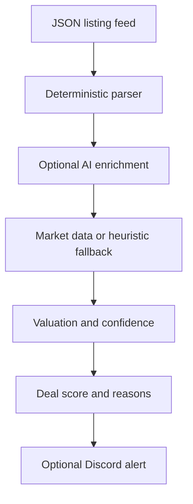

<p align="center">
  
</p>

[](https://github.com/quangshuynh/flipper/actions/workflows/ci.yml)
[](https://www.python.org/)
[](LICENSE)

Flipper analyzes secondhand computer listings, extracts hardware specifications, estimates resale value, and ranks potential deals using expected resale economics and evidence quality. It currently reads a local or exported JSON feed; it does not crawl marketplaces by itself.

## Pipeline



The deterministic parser runs first. AI enrichment is optional and only fills missing values. If AI, market data, or Discord is unavailable, the local analysis path can continue.

## Pricing

The estimator combines component heuristics with locally stored market prices when a matching database row exists. Market data is preferred; static component values are a fallback. eBay Browse results are active listing prices, not completed-sale prices, so estimates should be treated as directional.

For each listing, Flipper distinguishes:

- asking price
- estimated market value
- expected resale value, using a conservative 95% adjustment
- ideal buy price, using a 68% threshold
- estimated gross profit: `expected resale value - asking price`
- ROI: gross profit divided by asking price, when asking price is positive

Gross profit does not include fees, repairs, taxes, shipping, or labor because those costs are not modeled.

## Scoring

The deterministic score considers price versus value, expected gross profit, identified core hardware, extras, negotiability, and distance. Seller uncertainty is retained as listing metadata but never increases the score. A score is capped at 100 and should be read alongside the extracted fields and pricing evidence.

## Data and integrations

- `data/listings.json` is the sample local feed.
- `collectors/json_feed_collector.py` accepts a top-level list or `{ "listings": [...] }`.
- `pricing/market_updater.py` can refresh component prices through the eBay Browse API and stores them in `data/part_prices.db`.
- `utils/dedupe.py` stores processed listing IDs in `data/flipper_seen.db`.
- Discord alerts use `DISCORD_WEBHOOK_URL` and are optional.
- Groq-compatible AI enrichment uses `GROQ_API_KEY` and is optional.

## Setup

Use Python 3.13 or newer.

```bash
python -m venv .venv
.venv\\Scripts\\activate
pip install -r requirements-dev.txt
copy .env.example .env
```

Set only the environment variables needed for the integrations you use. `.env` is ignored by Git. The sample feed can be analyzed with:

```bash
python main.py
```

Discord is disabled when `DISCORD_WEBHOOK_URL` is empty. eBay price refresh is a separate operation and requires `EBAY_OAUTH_TOKEN`:

```bash
python -m pricing.market_updater
```

## eBay account deletion notifications

The isolated FastAPI service in `ebay/compliance.py` supports eBay Marketplace Account
Deletion/Closure endpoint verification and notification acknowledgement. It does not change or
depend on the CLI analysis pipeline.

Set these values in an uncommitted `.env` or, in production, in your hosting provider's secret
configuration:

```dotenv
EBAY_ACCOUNT_DELETION_TOKEN=
EBAY_ACCOUNT_DELETION_ENDPOINT=https://your-domain.example/api/ebay/account-deletion
EBAY_NOTIFICATION_ENV=production
EBAY_CLIENT_ID=
EBAY_CLIENT_SECRET=
```

The token must contain 32-80 letters, numbers, underscores, or hyphens. Generate one without
printing or committing it, for example by writing a Python-generated token directly into your
local `.env` (run this once):

```bash
python -c "import secrets; open('.env', 'a', encoding='utf-8').write('EBAY_ACCOUNT_DELETION_TOKEN=' + secrets.token_urlsafe(48) + '\n')"
```

Ensure `.env` contains only one value for that variable. The endpoint value must exactly match
the URL entered in eBay, including capitalization and any trailing slash; the configured route
above has no trailing slash.

For local development, load `.env` into the process environment and run:

```bash
uvicorn ebay.compliance:app --env-file .env --reload --host 127.0.0.1 --port 8000
```

The production start command is:

```bash
uvicorn ebay.compliance:app --host 0.0.0.0 --port 8000
```

Use the port mechanism required by your hosting provider when it supplies one. The production
callback must be deployed at a stable, publicly reachable HTTPS URL. eBay does not accept
`localhost` or an internal IP address, so the local server is only for development.

In the eBay Developer Portal, open the Production keyset's **Alerts & Notifications** page,
select **Marketplace Account Deletion**, save an alert email, and enter the exact deployed URL
and the same verification token. Saving triggers a GET challenge. After verification succeeds,
use **Send Test Notification** and confirm the deployed service returns a success response.

For each POST, the service Base64-decodes eBay's `X-EBAY-SIGNATURE` envelope, retrieves the
identified ECC public key through eBay's Notification API using an application OAuth token, and
verifies the ECDSA/SHA-1 signature before processing or acknowledging the notification. Public
keys are held in a process-local LRU cache for one hour (up to 100 keys), and application OAuth
tokens are reused until shortly before expiry. Missing, malformed, or invalid signatures receive
`412 Precondition Failed`; temporary OAuth or public-key retrieval failures receive a server
error so eBay can retry. Set `EBAY_CLIENT_ID` and `EBAY_CLIENT_SECRET` to the Production App ID
and Cert ID through secret configuration only; never commit or print either value. Keep
`EBAY_NOTIFICATION_ENV=production` for the Production callback. This setting is intentionally
separate from `EBAY_ENV`, which continues to select the Browse price updater's environment.

The current verified POST processing performs no data deletion because Flipper does not persist
eBay seller, buyer, or order data. Before adding seller/order persistence, implement irreversible
deletion of all applicable user data at the explicit processing boundary in
`ebay/compliance.py`.

## Tests and CI

Run the deterministic offline suite with:

```bash
pytest
ruff check .
ruff format --check .
```

GitHub Actions runs the same lint, formatting, and test commands on pushes and pull requests targeting `main`. Tests mock external behavior and do not send Discord messages or call eBay/Groq.

## Limitations

- The default collector consumes local/exported JSON rather than live marketplace pages.
- Valuation is heuristic and depends on accurate extracted hardware.
- eBay Browse data reflects asking prices and may include condition, shipping, and listing-quality differences.
- No repair, transaction fee, tax, shipping, labor, warranty, or inventory cost model is included.
- Missing or ambiguous specifications reduce confidence; they are not inferred as certainty.
- The optional AI integration is not required for core parsing and can fail independently.
- Local SQLite files are runtime state and should not be committed.

## Configuration

See `.env.example` for all supported variables, including location and deal thresholds. Do not put credentials, webhook URLs, or access tokens in source files.

## License

MIT. See [LICENSE](LICENSE).
