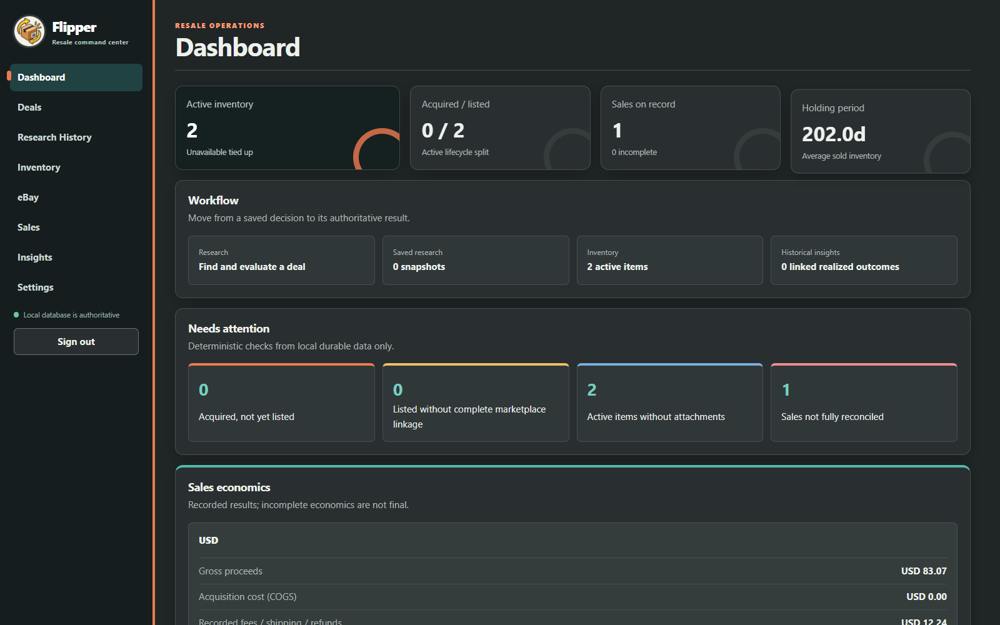
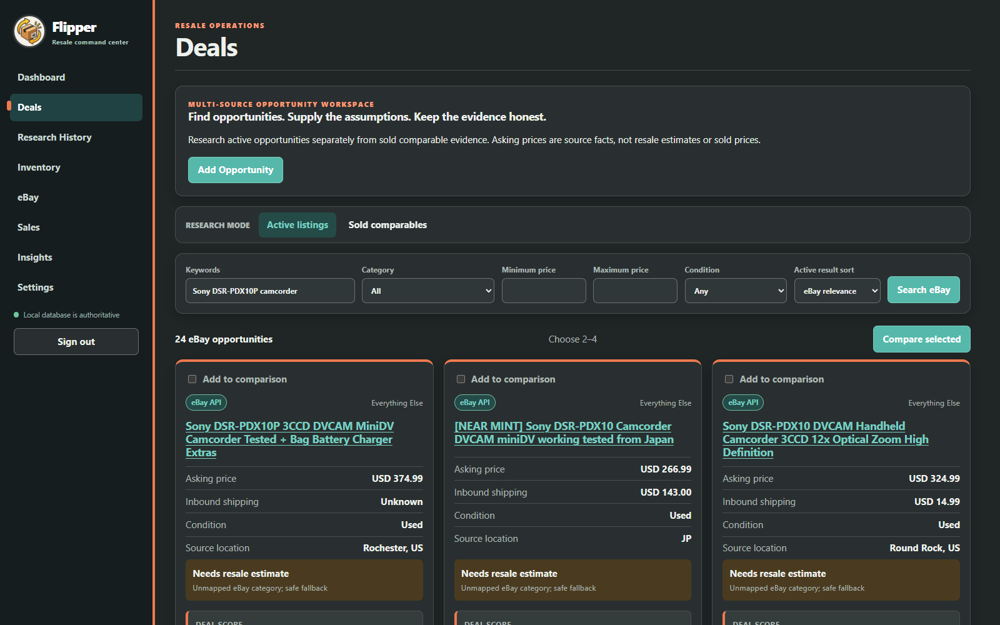
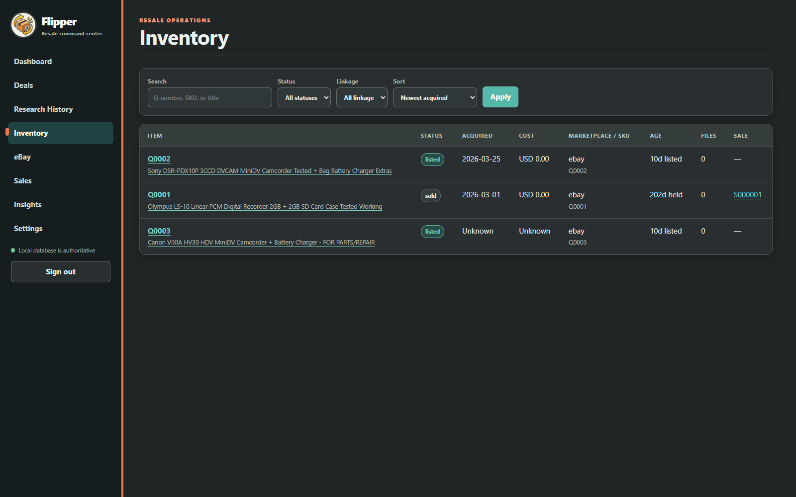
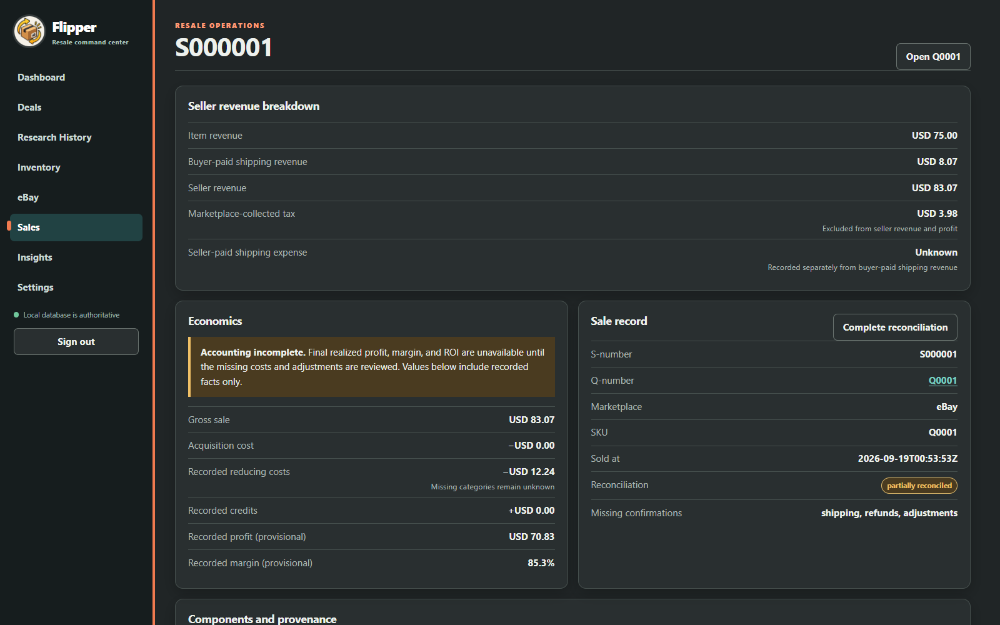

<p align="center">
  
</p>

<p align="center">
  <a href="https://github.com/quangshuynh/flipper/actions/workflows/ci.yml"></a>
  <a href="https://www.python.org/"></a>
  <a href="LICENSE"></a>
</p>

Flipper is a local-first resale intelligence and operations tool for researching opportunities,
tracking acquired inventory, reconciling marketplace activity, and measuring realized results.

It keeps research estimates separate from authoritative accounting facts, preserves explicit
unknowns instead of silently treating missing values as zero, and follows a deal from discovery
through acquisition, sale, reconciliation, and historical outcome analysis.

```text
Find the flip → Understand the economics → Acquire it → Track inventory
             → Sell it → Reconcile costs → Measure what actually happened
```

## What Flipper does

- Researches live eBay and user-entered multi-source opportunities, including active listings,
  sold comparables, comparison workflows, and local-trip economics.
- Analyzes user-provided JSON listing exports with deterministic parsing, valuation, and scoring.
- Explicitly saves durable research snapshots without turning estimates into accounting facts.
- Creates durable Q-number inventory records from explicit acquisitions.
- Tracks inventory lifecycle, attachments, valuations, marketplace linkage, sales, costs,
  and reconciliation in local SQLite.
- Reads eBay seller listings, orders, and Finances data through authorized APIs without
  marketplace writes.
- Reconciles seller revenue, marketplace fees, shipping, refunds, adjustments, and other
  recorded economics while preserving unknown or incomplete inputs.
- Compares recorded outcomes with the expectations captured during research.
- Presents local operational reports and workflow state in a server-rendered web application.

Flipper is not a marketplace crawler, a complete accounting system, or an eBay listing manager.

## Screenshots

<table>
  <tr>
    <td width="50%" valign="top">
      
      <br>
      <sub><strong>Dashboard: </strong>Operational overview of inventory, workflow state, reconciliation status, and recorded sales economics.</sub>
    </td>
    <td width="50%" valign="top">
      
      <br>
      <sub><strong>Deal research: </strong>Read-only marketplace research with active listings, sold-comparable separation, and comparison workflows.</sub>
    </td>
  </tr>
  <tr>
    <td width="50%" valign="top">
      
      <br>
      <sub><strong>Inventory: </strong>Durable Q-number records with lifecycle state, acquisition facts, marketplace linkage, and sale references.</sub>
    </td>
    <td width="50%" valign="top">
      
      <br>
      <sub><strong>Sale reconciliation: </strong>Revenue, marketplace fees, missing confirmations, and provisional economics kept distinct until reconciliation is complete.</sub>
    </td>
  </tr>
</table>

## Quick start

Python 3.13 or newer is recommended.

```bash
python -m venv .venv
python -m pip install -r requirements.txt
python main.py
```

See the [getting-started guide](docs/getting-started.md) for platform-specific activation,
configuration, feed structure, and optional integrations.

## Web app

```bash
uvicorn web.app:app --reload
```

Open `http://127.0.0.1:8000`.

The dashboard uses authoritative local data. Deals can search eBay through its read-only Browse
API or analyze a manually entered opportunity without fetching its source URL.

Without a configured owner password, the web app serves only this computer. Single-user sign-in,
CSRF protection, and fail-closed hosted mode are described in
[Web security](docs/operations/web-security.md). The production container, Render service, and
real-data cutover runbook are documented in
[Hosted deployment](docs/operations/deployment.md).

### Use Flipper from your phone at home

```bash
python main.py web lan
```

LAN mode keeps Flipper and its database on your computer while allowing a phone on the same
trusted Wi-Fi network to sign in. It requires an owner password and refuses non-private clients.

LAN mode is not intended for public Wi-Fi, port forwarding, or Internet exposure. See
[Phone access on your home network](docs/guides/phone-access.md).

## Documentation

The source documentation lives in [`docs/`](docs/index.md). Build it locally with:

```bash
python -m pip install -r requirements-dev.txt
mkdocs serve
```

GitHub Pages is enabled with **GitHub Actions** as its source. Documentation from this branch is
published at <https://quangshuynh.github.io/flipper/> after merge and a successful deployment
workflow.

## Local-first principles

The local inventory database is authoritative. Research estimates, external marketplace data,
and incomplete observations do not silently become accounting facts.

Runtime databases, attachments, credentials, tokens, buyer details, and raw marketplace
responses do not belong in Git. Optional AI, Discord, market-data, and eBay integrations remain
separable from deterministic local workflows.

## Development

```bash
python -m pytest
python -m ruff check .
python -m ruff format --check .
mkdocs build --strict
```

See [architecture](docs/development/architecture.md),
[testing and migrations](docs/development/testing-migrations.md), and the repository's
`AGENTS.md` before changing persistent or marketplace behavior.

## License

MIT. See [LICENSE](LICENSE).